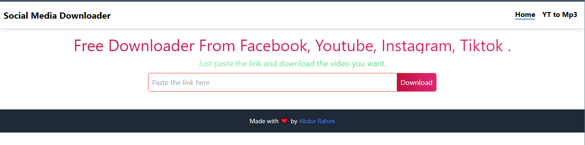

# Social Media Video Downloader

A powerful social media video downloader with both frontend (React) and backend (Express + yt-dlp) capabilities. Download videos from YouTube, TikTok, Instagram, Facebook, and 1000+ sites.

**Features:**
- 🎥 Download videos from YouTube, TikTok, Instagram, Facebook, and more
- 🎵 Extract audio as MP3
- 🍪 Browser cookie integration (Brave/Chrome/Firefox)
- 🔄 Binary file output (n8n compatible)
- ⚙️ Fully configurable via environment variables
- 🚀 RESTful API for automation workflows
## Star History

[](https://www.star-history.com/#AbdurRaahimm/social-media-downloader&Date)

## Usage
1. Clone this repository
```bash
git clone https://github.com/AbdurRaahimm/social-media-downloader.git
```
2. Go to directory
```bash
cd social-media-downloader
```
3. Run The Essential Dependency
```bash
npm install
```
4. Run `npm run dev` to start the development server
```bash
npm run dev
```
5. Run `npm run build` to build the project
```bash
npm run build
```
6. Run `npm run serve` to serve the build
```bash
npm run serve
```
7. Start the backend API server
```bash
npm run server
```

## Backend API Setup

### Prerequisites

1. **Install yt-dlp:**
```bash
# Linux/macOS
sudo curl -L https://github.com/yt-dlp/yt-dlp/releases/latest/download/yt-dlp -o /usr/local/bin/yt-dlp
sudo chmod a+rx /usr/local/bin/yt-dlp

# Or using pip
pip install yt-dlp
```

2. **Configure Environment Variables:**

Copy `.env.example` to `.env` and configure:

```env
# Server Configuration
PORT=7000
HOST=localhost
NODE_ENV=development

# CORS Configuration
CORS_ORIGIN=http://localhost:5173

# yt-dlp Configuration
YTDLP_COOKIES_FROM_BROWSER=brave       # brave, chrome, firefox, edge, safari
YTDLP_OUTPUT_PATH=./downloads
YTDLP_MAX_FILE_SIZE=500M
YTDLP_RATE_LIMIT=500M                  # Download speed limit

# Download Configuration
MAX_CONCURRENT_DOWNLOADS=3
DOWNLOAD_TIMEOUT=300000                # 5 minutes in milliseconds
```

3. **Start the backend server:**
```bash
npm run server
```

Server will start on `http://localhost:7000`

## API Endpoints & cURL Examples

### 1. Health Check
Check if the server is running:
```bash
curl http://localhost:7000/api/health
```

**Response:**
```json
{
  "status": "ok",
  "message": "Server is running",
  "timestamp": "2025-10-25T04:25:10.486Z"
}
```

### 2. View Configuration
View current environment variables and settings:
```bash
curl http://localhost:7000/api/config
```

**Response:**
```json
{
  "success": true,
  "config": {
    "host": "localhost",
    "port": "7000",
    "ytdlpCookiesFromBrowser": "brave",
    "ytdlpOutputPath": "./downloads",
    "ytdlpMaxFileSize": "500M",
    "ytdlpRateLimit": "500M"
  }
}
```

### 3. Get Video Information (JSON)
Fetch video metadata without downloading:
```bash
curl -X POST http://localhost:7000/api/video-info \
  -H "Content-Type: application/json" \
  -d '{"url": "https://youtu.be/VIDEO_ID"}'
```

**Response:**
```json
{
  "success": true,
  "data": {
    "title": "Video Title",
    "duration": 149,
    "thumbnail": "https://...",
    "uploader": "Channel Name",
    "description": "Video description",
    "formats": [...]
  }
}
```

### 4. Download Video (Binary File)
Download video and receive file as binary data:

```bash
# Download best quality video
curl -X POST http://localhost:7000/api/download \
  -H "Content-Type: application/json" \
  -d '{"url": "https://youtu.be/VIDEO_ID", "format": "best"}' \
  --output video.mp4

# Download specific format (720p)
curl -X POST http://localhost:7000/api/download \
  -H "Content-Type: application/json" \
  -d '{"url": "https://youtu.be/VIDEO_ID", "format": "22"}' \
  --output video.mp4

# Download worst quality (smaller file)
curl -X POST http://localhost:7000/api/download \
  -H "Content-Type: application/json" \
  -d '{"url": "https://youtu.be/VIDEO_ID", "format": "worst"}' \
  --output video.mp4
```

**Format options:**
- `best` - Best quality (video+audio merged)
- `bestvideo+bestaudio` - Best video and audio separately
- `worst` - Lowest quality
- `22` - 720p MP4
- `18` - 360p MP4
- See [yt-dlp formats](https://github.com/yt-dlp/yt-dlp#format-selection) for more

### 5. Download MP3 Audio (Binary File)
Download and convert to MP3:

```bash
curl -X POST http://localhost:7000/api/download-mp3 \
  -H "Content-Type: application/json" \
  -d '{"url": "https://youtu.be/VIDEO_ID"}' \
  --output audio.mp3
```

### 6. Download from Other Platforms

**TikTok:**
```bash
curl -X POST http://localhost:7000/api/download \
  -H "Content-Type: application/json" \
  -d '{"url": "https://www.tiktok.com/@user/video/123456"}' \
  --output tiktok.mp4
```

**Instagram:**
```bash
curl -X POST http://localhost:7000/api/download \
  -H "Content-Type: application/json" \
  -d '{"url": "https://www.instagram.com/reel/ABC123/"}' \
  --output instagram.mp4
```

**Facebook:**
```bash
curl -X POST http://localhost:7000/api/download \
  -H "Content-Type: application/json" \
  -d '{"url": "https://www.facebook.com/watch?v=123456"}' \
  --output facebook.mp4
```

**Twitter/X:**
```bash
curl -X POST http://localhost:7000/api/download \
  -H "Content-Type: application/json" \
  -d '{"url": "https://twitter.com/user/status/123456"}' \
  --output twitter.mp4
```

### 7. Advanced cURL Examples

**With verbose output (debugging):**
```bash
curl -X POST http://localhost:7000/api/download-mp3 \
  -H "Content-Type: application/json" \
  -d '{"url": "https://youtu.be/VIDEO_ID"}' \
  --output audio.mp3 \
  -v
```

**With timeout:**
```bash
curl -X POST http://localhost:7000/api/download-mp3 \
  -H "Content-Type: application/json" \
  -d '{"url": "https://youtu.be/VIDEO_ID"}' \
  --output audio.mp3 \
  --max-time 120
```

**Save response headers:**
```bash
curl -X POST http://localhost:7000/api/download-mp3 \
  -H "Content-Type: application/json" \
  -d '{"url": "https://youtu.be/VIDEO_ID"}' \
  --output audio.mp3 \
  -D headers.txt
```

**Show download progress:**
```bash
curl -X POST http://localhost:7000/api/download-mp3 \
  -H "Content-Type: application/json" \
  -d '{"url": "https://youtu.be/VIDEO_ID"}' \
  --output audio.mp3 \
  --progress-bar
```

## n8n Integration

The API returns binary file data, making it perfect for n8n automation workflows.

### n8n HTTP Request Node Configuration:

1. **Method**: POST
2. **URL**: `http://localhost:7000/api/download-mp3`
3. **Body Content Type**: JSON
4. **Body Parameters**:
   ```json
   {
     "url": "{{ $json.videoUrl }}"
   }
   ```
5. **Options > Response**:
   - Response Format: **File**
   - Output Property Name: `data`

### Example n8n Workflow:

```
Webhook/Trigger
    ↓
HTTP Request (download-mp3)
    ↓
Write Binary File / Google Drive / Email
```

See [server/N8N_INTEGRATION.md](./server/N8N_INTEGRATION.md) for complete guide.

## Features
- Download videos from YouTube
- Download videos from TikTok
- Download videos from Instagram  
- Download videos from Facebook
- Download videos from Twitter/X
- Extract audio as MP3
- RESTful API with binary output
- Browser cookie support
- Configurable via environment variables

## Screenshots



## Demo
[Live Demo](https://social-media-downloader-eight.vercel.app/)


## Tools Used

### Frontend
- React 18
- Vite 4
- Tailwind CSS 3
- ESLint
- Prettier

### Backend
- Node.js + Express
- yt-dlp
- dotenv (environment variables)
- CORS

## Browser Cookie Support

The backend uses browser cookies for authenticated downloads. Supported browsers:

- **brave** (default)
- **chrome**
- **chromium**
- **edge**
- **firefox**
- **opera**
- **safari**
- **vivaldi**

Change in `.env`:
```env
YTDLP_COOKIES_FROM_BROWSER=chrome
```

### Why Browser Cookies?

Browser cookies enable:
- ✅ Downloading age-restricted content
- ✅ Accessing private/member-only videos
- ✅ Bypassing geographic restrictions
- ✅ Higher quality downloads
- ✅ Avoiding bot detection

**Note**: Make sure you're logged into the platform (YouTube, etc.) in your browser before downloading.

## Environment Variables Reference

| Variable | Description | Default | Required |
|----------|-------------|---------|----------|
| `PORT` | Server port | 7000 | ✅ Yes |
| `HOST` | Server host | localhost | No |
| `NODE_ENV` | Environment | development | No |
| `CORS_ORIGIN` | CORS allowed origin | http://localhost:5173 | No |
| `YTDLP_COOKIES_FROM_BROWSER` | Browser for cookies | brave | No |
| `YTDLP_OUTPUT_PATH` | Download directory | ./downloads | ✅ Yes |
| `YTDLP_MAX_FILE_SIZE` | Max file size | 500M | No |
| `YTDLP_RATE_LIMIT` | Download speed limit | 500M | No |
| `MAX_CONCURRENT_DOWNLOADS` | Concurrent downloads | 3 | No |
| `DOWNLOAD_TIMEOUT` | Timeout (ms) | 300000 | No |

## Troubleshooting

### Issue: 403 Forbidden Error

**Cause**: YouTube/platform bot protection

**Solutions**:
1. Log into the platform in your browser first
2. Make sure cookies are accessible
3. Try a different browser (`YTDLP_COOKIES_FROM_BROWSER`)
4. Update yt-dlp: `sudo yt-dlp -U`
5. Test with a different video/platform

### Issue: Server won't start

**Check**:
```bash
# Check if port is in use
lsof -ti:7000

# Kill process on port
fuser -k 7000/tcp

# Check logs
tail -f server.log
```

### Issue: yt-dlp not found

**Install**:
```bash
# Check if installed
which yt-dlp

# Install
sudo curl -L https://github.com/yt-dlp/yt-dlp/releases/latest/download/yt-dlp -o /usr/local/bin/yt-dlp
sudo chmod a+rx /usr/local/bin/yt-dlp
```

### Issue: Browser cookies not working

**Solutions**:
1. Make sure the browser is installed
2. Check browser profile directory exists
3. Try closing the browser first
4. Verify `YTDLP_COOKIES_FROM_BROWSER` value is correct

### Issue: File not downloading

**Debug**:
```bash
# Test with curl verbose
curl -X POST http://localhost:7000/api/download-mp3 \
  -H "Content-Type: application/json" \
  -d '{"url": "VIDEO_URL"}' \
  --output audio.mp3 \
  -v

# Check server logs
tail -f server.log

# Test yt-dlp directly
yt-dlp --cookies-from-browser brave "VIDEO_URL"
```

### Issue: n8n not receiving binary data

**Check**:
1. HTTP Request node has "Response Format: File" selected
2. Binary property name matches (default: `data`)
3. Server is returning binary (check with curl `--output`)
4. No errors in n8n execution logs

## Supported Platforms

Works with 1000+ sites via yt-dlp, including:

- **Video**: YouTube, Vimeo, Dailymotion, Twitch, Reddit
- **Social Media**: TikTok, Instagram, Facebook, Twitter/X, LinkedIn
- **Live Streaming**: Twitch, YouTube Live, Facebook Live
- **Educational**: Coursera, Udemy, Khan Academy
- **And many more...**

Full list: [yt-dlp supported sites](https://github.com/yt-dlp/yt-dlp/blob/master/supportedsites.md)

## Project Structure

```
social-media-downloader/
├── .env                      # Environment configuration (create from .env.example)
├── .env.example              # Example environment file
├── .gitignore               # Git ignore rules
├── package.json             # Dependencies and scripts
├── README.md                # This file
├── SETUP_COMPLETE.md        # Complete setup documentation
├── server/                  # Backend API
│   ├── index.js            # Express server with yt-dlp integration
│   ├── README.md           # Backend documentation
│   └── N8N_INTEGRATION.md  # n8n workflow guide
├── downloads/              # Downloaded files (auto-created)
├── src/                    # React frontend
│   ├── components/        # React components
│   ├── pages/            # Page components
│   └── utils/            # Utility functions
└── public/               # Static assets
```

## API Response Formats

### JSON Response (video-info, health, config)
```json
{
  "success": true,
  "data": { ... }
}
```

### Binary Response (download, download-mp3)
- Content-Type: `application/octet-stream` or `audio/mpeg`
- Content-Disposition: `attachment; filename="video.mp4"`
- Body: Binary file data

### Error Response
```json
{
  "success": false,
  "error": "Error message"
}
```

## Scripts Reference

```bash
# Frontend
npm run dev          # Start Vite dev server (port 5173)
npm run build        # Build for production
npm run preview      # Preview production build

# Backend
npm run server       # Start API server (port 7000)
npm run server:dev   # Start with nodemon (auto-reload)

# Linting
npm run lint         # Run ESLint
```

## Security Notes

⚠️ **Important Security Considerations**:

1. **Keep `.env` secure** - Never commit to version control (already in `.gitignore`)
2. **Browser cookies** - Only use on trusted systems
3. **CORS** - Configure `CORS_ORIGIN` properly in production
4. **Rate limiting** - Consider adding rate limiting for public APIs
5. **File cleanup** - Files are auto-deleted after sending to save space
6. **Authentication** - Add `API_KEY` for production use

## Production Deployment

### Environment Variables for Production

```env
NODE_ENV=production
PORT=7000
HOST=0.0.0.0
CORS_ORIGIN=https://your-frontend-domain.com
YTDLP_COOKIES_FROM_BROWSER=brave
YTDLP_MAX_FILE_SIZE=500M
YTDLP_RATE_LIMIT=5M
```

### Using PM2 (Recommended)

```bash
# Install PM2
npm install -g pm2

# Start server
pm2 start server/index.js --name "video-downloader"

# Auto-restart on reboot
pm2 startup
pm2 save

# Monitor
pm2 logs video-downloader
pm2 monit
```

### Using Docker

```dockerfile
FROM node:18-alpine

# Install yt-dlp
RUN apk add --no-cache python3 py3-pip ffmpeg
RUN pip3 install yt-dlp

WORKDIR /app
COPY package*.json ./
RUN npm install --production
COPY . .

EXPOSE 7000
CMD ["node", "server/index.js"]
```

## Additional Documentation

- 📖 [Backend Setup Guide](./server/README.md)
- 📖 [n8n Integration Guide](./server/N8N_INTEGRATION.md)
- 📖 [Complete Setup Documentation](./SETUP_COMPLETE.md)

## Contributing

Contributions are welcome! Please feel free to submit a Pull Request.

## License

MIT License - see LICENSE file for details

## Connect on Social Media
- [Twitter](https://twitter.com/AbdurRahim4G)
- [Instagram](https://www.instagram.com/abdurrahim4g/)
- [Facebook](https://www.facebook.com/Rahim72446)
- [LinkedIn](https://www.linkedin.com/in/abdur-rahim4g/)
- [YouTube](https://youtube.com/@AbdurRahimm)


